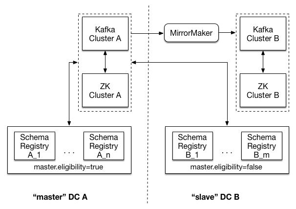

|sr| Production Deployment
--------------------------

This section describes the key considerations before going to production with your cluster. However, it is not an
exhaustive guide to running your |sr| in production.

Three main areas are covered:

* Logistical considerations, such as hardware recommendations and deployment strategies
* Configuration more suited to a production environment
* Post-deployment considerations, such multi-data center setup

.. contents::
    :local:

Hardware
~~~~~~~~

If you’ve been following the normal development path, you’ve probably been playing with |sr|
on your laptop or on a small cluster of machines laying around. But when it comes time to deploying
|sr| to production, there are a few recommendations that you should consider. Nothing is a hard-and-fast rule.

Memory
^^^^^^

|sr| uses Kafka as a commit log to store all registered schemas durably, and maintains a few in-memory indices to make schema lookups faster. A conservative upper bound on the number of unique schemas registered in a large data-oriented company like LinkedIn is around 10,000. Assuming roughly 1000 bytes heap overhead per schema on average, heap size of 1GB would be more than sufficient.

CPUs
^^^^

CPU usage in |sr| is light. The most computationally intensive task is checking compatibility of two schemas, an infrequent operation which occurs primarily when new schemas versions are registered under a subject.

If you need to choose between faster CPUs or more cores, choose more cores. The extra concurrency that multiple
cores offers will far outweigh a slightly faster clock speed.

Disks
^^^^^

|sr| does not have any disk resident data. It currently uses Kafka as a commit log to store all schemas durably and holds in-memory indices of all schemas. Therefore, the only disk usage comes from storing the log4j logs.

Network
^^^^^^^

A fast and reliable network is obviously important to performance in a distributed system. Low latency helps ensure that nodes can communicate easily, while high bandwidth helps shard movement and recovery. Modern data-center networking (1 GbE, 10 GbE) is sufficient for the vast majority of clusters.

Avoid clusters that span multiple data centers, even if the data centers are colocated in close proximity. Definitely avoid clusters that span large geographic distances.

Larger latencies tend to exacerbate problems in distributed systems and make debugging and resolution more difficult.

Often, people might assume the pipe between multiple data centers is robust or low latency. But this is usually not true and network failures might happen at some point. Please refer to our recommended :ref:`schemaregistry_mirroring`.

JVM
~~~

We recommend running the latest version of JDK 1.8 with the G1 collector (older freely available versions have disclosed security vulnerabilities).

If you are still on JDK 1.7 (which is also supported) and you are planning to use G1 (the current default), make
sure you're on u51. We tried out u21 in testing, but we had a number of problems with the GC implementation in
that version.

Our recommended GC tuning looks like this:

.. sourcecode:: bash

   -Xms1g -Xmx1g -XX:MetaspaceSize=96m -XX:+UseG1GC -XX:MaxGCPauseMillis=20 \
          -XX:InitiatingHeapOccupancyPercent=35 -XX:G1HeapRegionSize=16M \
          -XX:MinMetaspaceFreeRatio=50 -XX:MaxMetaspaceFreeRatio=80

Important Configuration Options
~~~~~~~~~~~~~~~~~~~~~~~~~~~~~~~

The full set of configuration options are documented in :ref:`schemaregistry_config`.

However, there are some logistical configurations that should be changed for production. These changes are necessary because there is no way to set a good default (because it depends on your cluster layout).

``kafkastore.connection.url``
|zk| URL for the Kafka cluster

* Type: string
* Importance: high

``port``
Port to listen on for new connections.

* Type: int
* Default: 8081
* Importance: high

``host.name``
Hostname to publish to |zk| for clients to use. In IaaS environments, this may need to be different from the interface to which the broker binds. If this is not set, it will use the value returned from ``java.net.InetAddress.getCanonicalHostName()``.

* Type: string
* Default: ``host.name``
* Importance: high

.. note::

     Configure ``min.insync.replicas`` on the Kafka server for the schemas topic that stores all registered
     schemas to be higher than 1. For example, if the ``kafkastore.topic.replication.factor`` is 3, then set
     ``min.insync.replicas`` on the Kafka server for the ``kafkastore.topic`` to 2. This ensures that the
     register schema write is considered durable if it gets committed on at least 2 replicas out of 3. Furthermore, it is best to set ``unclean.leader.election.enable`` to false so that a replica outside of the isr is never elected leader (potentially resulting in data loss).

Don't Touch These Settings!
~~~~~~~~~~~~~~~~~~~~~~~~~~~

Storage settings
^^^^^^^^^^^^^^^^

|sr| stores all schemas in a Kafka topic defined by ``kafkastore.topic``. Since this Kafka topic acts as the commit log for the |sr| database and is the source of truth, writes to this store need to be durable. |sr| ships with very good defaults for all settings that affect the durability of writes to the Kafka based commit log. Finally, ``kafkastore.topic`` must be a compacted topic to avoid data loss. Whenever in doubt, leave these settings alone. If you must create the topic manually, this is an example of proper configuration:

.. sourcecode:: bash

  # kafkastore.topic=_schemas
  $ bin/kafka-topics --create --zookeeper localhost:2181 --topic connect-configs --replication-factor 3 --partitions 1 --config cleanup.policy=compact

``kafkastore.topic``
The single partition topic that acts as the durable log for the data. This must be a compacted topic to avoid data loss due to retention policy.

* Type: string
* Default: "_schemas"
* Importance: high

``kafkastore.topic.replication.factor``
The desired replication factor of the schema topic. The actual replication factor will be the smaller of this value and the number of live Kafka brokers.

* Type: int
* Default: 3
* Importance: high

``kafkastore.timeout.ms``
The timeout for an operation on the Kafka store. This is the maximum time that a register call blocks.

* Type: int
* Default: 500
* Importance: medium

Kafka & ZooKeeper
~~~~~~~~~~~~~~~~~

Please refer to :ref:`schemaregistry_operations` for recommendations on operationalizing Kafka and |zk|.

.. _schemaregistry_mirroring:

Backup and Restore
~~~~~~~~~~~~~~~~~~

As discussed in :ref:`schemaregistry_design`, all schemas, subject/version and id metadata, and compatibility settings are appended as messages to a special Kafka topic ``<kafkastore.topic>`` (default ``_schemas``). This topic is a common source of truth for schema IDs, and you should back it up. In case of some unexpected event that makes the topic inaccessible, you can restore this schemas topic from the backup, enabling consumers to continue to read Kafka messages that were sent in the Avro format.

As a best practice, we recommend backing up the ``<kafkastore.topic>``. If you already have a multi-datacenter Kafka deployment, you can backup this topic to another Kafka cluster using `Confluent Replicator <https://docs.confluent.io/current/multi-dc/index.html>`_. Otherwise, you can use a `Kafka sink connector <https://docs.confluent.io/current/connect/index.html>`_ to copy the topic data from Kafka to a separate storage (e.g. AWS S3). These will continuously update as the schema topic updates.

In lieu of either of those options, you can also use Kafka command line tools to periodically save the contents of the topic to a file. For the following examples, we assume that ``<kafkastore.topic>`` has its default value "_schemas".

To backup the topic, use the ``kafka-console-consumer`` to capture messages from the schemas topic to a file called "schemas.log". Save this file off the Kafka cluster.

.. sourcecode:: bash

   bin/kafka-console-consumer --bootstrap-server localhost:9092 --topic _schemas --from-beginning --property print.key=true --timeout-ms 1000 1> schemas.log

To restore the topic, use the ``kafka-console-producer`` to write the contents of file "schemas.log" to a new schemas topic. This examples uses a new schemas topic name "_schemas_restore". If you use a new topic name or use the old one (i.e. "_schemas"), make sure to set ``<kafkastore.topic>`` accordingly.

.. sourcecode:: bash

   bin/kafka-console-producer --broker-list localhost:9092 --topic _schemas_restore --property parse.key=true < schemas.log

Multi-DC Setup
~~~~~~~~~~~~~~

Overview
^^^^^^^^
Spanning multiple datacenters with your |sr| provides additional protection against data loss and improved latency. The recommended multi-datacenter deployment designates one datacenter as "master" and all others as "slaves". If the "master" datacenter fails and is unrecoverable, a "slave" datacenter will need to be manually designated the new "master" through the steps in the Run Book below.

Recommended Deployment
^^^^^^^^^^^^^^^^^^^^^^

In the image above, there are two datacenters - DC A, and DC B. Each of the two datacenters has its own |zk|
cluster, Kafka cluster, and |sr| cluster. Both |sr| clusters link to Kafka and |zk| in DC A. Note that the |sr| instances in DC B have ``master.eligibility`` set to false, meaning that none can ever be elected master.

To protect against complete loss of DC A, Kafka cluster A (the source) is replicated to Kafka cluster B (the target). This is achieved by running the :ref:`Replicator` <connect_replicator>` local to the target cluster.

Important Settings
^^^^^^^^^^^^^^^^^^

``kafkastore.connection.url``
kafkastore.connection.url should be identical across all |sr| nodes. By sharing this setting, all |sr| instances will point to the same |zk| cluster.

``schema.registry.zk.namespace``
Namespace under which |sr| related metadata is stored in |zk|. This setting should be identical across all nodes in the same |sr|.

``master.eligibility``
A |sr| server with ``master.eligibility`` set to false is guaranteed to remain a slave during any master election. |sr| instances in a "slave" data center should have this set to false, and |sr| instances local to the shared Kafka cluster should have this set to true.

Setup
^^^^^

Assuming you have |sr| running, here are the recommended steps to add |sr| instances in a new "slave" datacenter (call it DC B):

- In DC B, make sure Kafka has ``unclean.leader.election.enable`` set to false.

- In Kafka in DC B, create the ``_schemas`` topic. It should have 1 partition, ``kafkastore.topic.replication.factor`` of 3, and ``min.insync.replicas`` at least 2.

- In DC B, run Replicator with Kafka in the "master" datacenter (DC A) as the source and Kafka in DC B as the target.

- In the |sr| config files in DC B, set ``kafkastore.connection.url`` and ``schema.registry.zk.namespace`` to match the instances already running, and set ``master.eligibility`` to false.

- Start your new |sr| instances with these configs.

Run Book
^^^^^^^^

Let's say you have |sr| running in multiple datacenters, and you have lost your "master" datacenter; what do you do? First, note that the remaining |sr| instances will continue to be able to serve any request which does not result in a write to Kafka. This includes GET requests on existing ids and POST requests on schemas already in the registry.

- If possible, revive the "master" datacenter by starting Kafka and |sr| as before.

- If you must designate a new datacenter (call it DC B) as "master", update the |sr| config files so that ``kafkastore.connection.url`` points to the local |zk|, and change ``master.eligibility`` to true. The restart your |sr| instances with these new configs in a rolling fashion.
