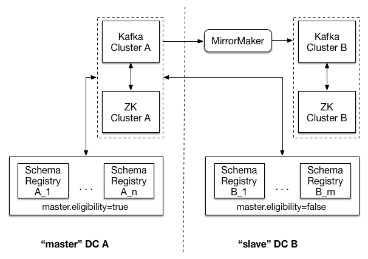

Production Deployment
---------------------

This section is not meant to be an exhaustive guide to running your Schema Registry in production, but it
covers the key things to consider before putting your cluster live. Three main areas are covered:

* Logistical considerations, such as hardware recommendations and deployment strategies
* Configuration more suited to a production environment
* Post-deployment considerations, such multi-data center setup

.. toctree::
   :maxdepth: 3

Hardware
~~~~~~~~

If you’ve been following the normal development path, you’ve probably been playing with Schema Registry
on your laptop or on a small cluster of machines laying around. But when it comes time to deploying 
Schema Registry to production, there are a few recommendations that you should consider. Nothing is a hard-and-fast rule.

Memory
^^^^^^

Schema Registry uses Kafka as a commit log to store all registered schemas durably, and maintains a few in-memory indices to make schema lookups faster. A conservative upper bound on the number of unique schemas registered in a large data-oriented company like LinkedIn is around 10,000. Assuming roughly 1000 bytes heap overhead per schema on average, heap size of 1GB would be more than sufficient.

CPUs
^^^^

CPU usage in Schema Registry is light. The most computationally intensive task is checking compatibility of two schemas, an infrequent operation which occurs primarily when new schemas versions are registered under a subject.

If you need to choose between faster CPUs or more cores, choose more cores. The extra concurrency that multiple
cores offers will far outweigh a slightly faster clock speed.

Disks
^^^^^

Schema Registry does not have any disk resident data. It currently uses Kafka as a commit log to store all schemas durably and holds in-memory indices of all schemas. Therefore, the only disk usage comes from storing the log4j logs.

Network
^^^^^^^

A fast and reliable network is obviously important to performance in a distributed system. Low latency helps ensure that nodes can communicate easily, while high bandwidth helps shard movement and recovery. Modern data-center networking (1 GbE, 10 GbE) is sufficient for the vast majority of clusters.

Avoid clusters that span multiple data centers, even if the data centers are colocated in close proximity. Definitely avoid clusters that span large geographic distances.

Larger latencies tend to exacerbate problems in distributed systems and make debugging and resolution more difficult.

Often, people might assume the pipe between multiple data centers is robust or low latency. But this is usually not true and network failures might happen at some point. Please refer to our recommended :ref:`mirroring`.

JVM
~~~

We recommend running JDK 1.7 u51, and using the G1 collector. If you do this (and we highly recommend it), make
sure you're on u51. We tried out u21 in testing, but we had a number of problems with the GC implementation in 
that version. Our recommended GC tuning looks like this:

``-Xms1g -Xmx1g -XX:PermSize=48m -XX:MaxPermSize=48m -XX:+UseG1GC
-XX:MaxGCPauseMillis=20 -XX:InitiatingHeapOccupancyPercent=35``

Important Configuration Options
~~~~~~~~~~~~~~~~~~~~~~~~~~~~~~~

The full set of configuration options are documented in :ref:`schemaregistry_config`.

However, there are some logistical configurations that should be changed for production. These changes are necessary because there is no way to set a good default (because it depends on your cluster layout).

``kafkastore.connection.url``
Zookeeper url for the Kafka cluster

* Type: string
* Importance: high

``port``
Port to listen on for new connections.

* Type: int
* Default: 8081
* Importance: high

``host.name``
Hostname to publish to ZooKeeper for clients to use. In IaaS environments, this may need to be different from the interface to which the broker binds. If this is not set, it will use the value returned from ``java.net.InetAddress.getCanonicalHostName()``.

* Type: string
* Default: ``host.name``
* Importance: high

.. note::

     Configure ``min.insync.replicas`` on the Kafka server for the schemas topic that stores all registered
     schemas to be higher than 1. For example, if the ``kafkastore.topic.replication.factor`` is 3, then set
     ``min.insync.replicas`` on the Kafka server for the ``kafkastore.topic`` to 2. This ensures that the
     register schema write is considered durable if it gets committed on at least 2 replicas out of 3. Furthermore, it is best to set ``unclean.leader.election.enable`` to false so that a replica outside of the isr is never elected leader (potentially resulting in data loss).

Don't Touch These Settings!
~~~~~~~~~~~~~~~~~~~~~~~~~~~

Storage settings
^^^^^^^^^^^^^^^^

Schema Registry stores all schemas in a Kafka topic defined by ``kafkastore.topic``. Since this Kafka topic acts as the commit log for the Schema Registry database and is the source of truth, writes to this store need to be durable. Schema Registry ships with very good defaults for all settings that affect the durability of writes to the Kafka based commit log. Whenever in doubt, leave these settings alone.

``kafkastore.topic``
The single partition topic that acts as the durable log for the data

* Type: string
* Default: "_schemas"
* Importance: high

``kafkastore.topic.replication.factor``
The desired replication factor of the schema topic. The actual replication factor will be the smaller of this value and the number of live Kafka brokers.

* Type: int
* Default: 3
* Importance: high

``kafkastore.write.max.retries``
Retry the register schema write up to this many times on failure

* Type: int
* Default: 5
* Importance: medium

``kafkastore.write.retry.backoff.ms``
The amount of time in milliseconds to wait before attempting to retry a failed write to the Kafka store

* Type: int
* Default: 100
* Importance: medium

``kafkastore.timeout.ms``
The timeout for an operation on the Kafka store. This is the maximum time that a register call blocks.

* Type: int
* Default: 500
* Importance: medium

Kafka & ZooKeeper
~~~~~~~~~~~~~~~~~

Please refer to the Kafka Operations document for recommendations on operationalizing Kafka and ZooKeeper.

.. _mirroring:

Multi-DC Setup
~~~~~~~~~~~~~~

Overview
^^^^^^^^
What and why:
If you wish to set up Schema Registry in multiple datacenters... TBD
if DC fails, need to do something manually to recover

Recommended Deployment
^^^^^^^^^^^^^^^^^^^^^^

Brief explanation of pic - master, slave DC, mirror maker etc.
where mirror maker runs (recommend that it writes locally, reads remotely)

Important Settings
^^^^^^^^^^^^^^^^^^

``kafkastore.connection.url``
kafkastore.connection.url should be identical across all schema registry nodes. By sharing this setting, all Schema Registry instances will point to the same ZooKeeper cluster.

``schema.registry.zk.namespace``
Namespace under which schema registry related metadata is stored in Zookeeper. This setting should be identical across all nodes in the same schema registry.

``master.eligibility``
A schema registry server with ``master.eligibility`` set to false is guaranteed to remain a slave during any master election. Schema Registry instances in a "slave" data center should have this set to false, and Schema Registry instances local to the shared Kafka cluster should have this set to true.

Setup
^^^^^

pre mirror maker - want to create topic w/desired configs - uncleanleader, #replicas,
where mirror maker runs

Run book
^^^^^^^^
Suppose in the example above that DC A has gone completely dark. In that case, the schema registries in DC B will have no master, but will continue to be able to serve any request that does not result in a write to the (now dead) underlying Kafka store. This includes GET requests on existing ids and POST requests on schemas already in the registry.

If machines in DC A can be brought back up, do so.

If the machines in DC A are brought back up, the schema registries can be restarted in a rolling fashion with their keeping their original configuration settings intact.

If it is necessary to point the schema registry nodes in DC B to their local Kafka cluster, the schema registries should be restarted in a rolling fashion with new configurations updating ``kafkastore.connection.url`` to point to the Zookeeper cluster in DC B, and with ``master.eligibility`` set to true. Note that a given node will not be able to register new schemas or be consistent with the new master until after restart.

