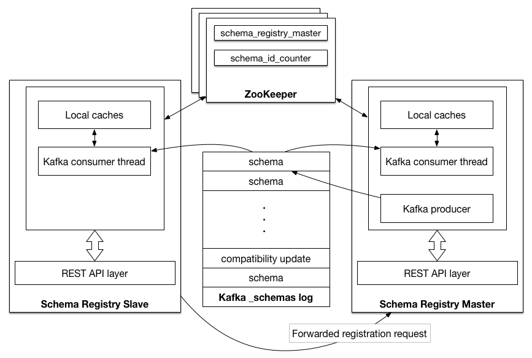

.. _schemaregistry_intro:

|sr|
====

|sr| provides a serving layer for your metadata. It provides a RESTful interface for storing and retrieving Avro schemas. It stores a versioned history of all schemas, provides multiple compatibility settings and allows evolution of schemas according to the configured compatibility settings and expanded Avro support. It provides serializers that plug into Kafka clients that handle schema storage and retrieval for Kafka messages that are sent in the Avro format.

|sr| is a distributed storage layer for Avro Schemas which uses Kafka as its underlying storage mechanism. Some key design decisions:

* Assigns globally unique ID to each registered schema. Allocated IDs are guaranteed to be monotonically increasing but not necessarily consecutive.
* Kafka provides the durable backend, and functions as a write-ahead changelog for the state of |sr| and the schemas it contains.
* |sr| is designed to be distributed, with single-master architecture, and |zk|/Kafka coordinates master election (based on the configuration).

.. tip:: To see a working example of |sr|, check out :ref:`Confluent Platform demo <cp-demo>`. The demo shows you how to deploy a
         Kafka streaming ETL, including |sr|, using KSQL for stream processing.

.. contents:: Contents
    :local:
    :depth: 1

Schema ID Allocation
--------------------

Schema ID allocation always happen in the master node and they ensure that the Schema IDs are
monotonically increasing.

If you are using Kafka master election, the Schema ID is always based off the last ID that was
written to Kafka store. During a master re-election, batch allocation happens only after the new
master has caught up with all the records in the store ``<kafkastore.topic>``.

If you are using |zk| master election, ``/<schema.registry.zk.namespace>/schema_id_counter``
path stores the upper bound on the current ID batch, and new batch allocation is triggered by both master election and exhaustion of the current batch. This batch allocation helps guard against potential zombie-master scenarios, (for example, if the previous master had a GC pause that lasted longer than the |zk| timeout, triggering master reelection).

Kafka Backend
-------------
Kafka is used as |sr| storage backend. The special Kafka topic ``<kafkastore.topic>`` (default ``_schemas``), with a single partition, is used as a highly available write ahead log. All schemas, subject/version and ID metadata, and compatibility settings are appended as messages to this log. A |sr| instance therefore both produces and consumes messages under the ``_schemas`` topic. It produces messages to the log when, for example, new schemas are registered under a subject, or when updates to compatibility settings are registered. |sr| consumes from the ``_schemas`` log in a background thread, and updates its local caches on consumption of each new ``_schemas`` message to reflect the newly added schema or compatibility setting. Updating local state from the Kafka log in this manner ensures durability, ordering, and easy recoverability.

.. _schemaregistry_single_master:

Single Master Architecture
--------------------------
|sr| is designed to work as a distributed service using single master architecture. In this configuration, at most one |sr| instance is master at any given moment (ignoring pathological 'zombie masters'). Only the master is capable of publishing writes to the underlying Kafka log, but all nodes are capable of directly serving read requests. Slave nodes serve registration requests indirectly by simply forwarding them to the current master, and returning the response supplied by the master.
Prior to |sr| version 4.0, master election was always coordinated through |zk|.
Master election can now optionally happen via Kafka group protocol as well.

.. note::

         Please make sure not to mix up the election modes amongst the nodes in same cluster.
         This will lead to multiple masters and issues with your operations.

---------------------------------
Kafka Coordinator Master Election
---------------------------------

.. figure:: schema-registry-design-kafka.png
   :align: center

   Kafka based Schema Registry

Kafka based master election is chosen when ``<kafkastore.connection.url>`` is not configured and
has the Kafka bootstrap brokers ``<kafkastore.bootstrap.servers>`` specified. The kafka group
protocol, chooses one amongst the master eligible nodes ``master.eligibility=true`` as the master. Kafka-based master
election can be used in cases where |zk| is not available, for example for hosted or cloud
Kafka environments, or if access to |zk| has been locked down.

--------------------
|zk| Master Election
--------------------

   ZooKeeper based Schema Registry

|zk| master election is chosen when |zk| URL is specified in |sr| config
``<kafkastore.connection.url>``.
The current master is maintained as data in the ephemeral node on the ``/<schema.registry.zk.namespace>/schema_registry_master`` path in |zk|. |sr| nodes listen to data change and deletion events on this path, and shutdown or failure of the master process triggers each node with ``master.eligibility=true`` to participate in a new round of election. Master election is a simple 'first writer wins' policy: the first node to successfully write its own data to ``/<schema.registry.zk.namespace>/schema_registry_master`` is the new master.

|sr| is also designed for multi-colo configuration. See :ref:`schemaregistry_mirroring` for more details.

Documentation
-------------

.. toctree::
   :maxdepth: 1

   installation
   config
   schema_registry_tutorial
   ../../cloud/connect/schema-reg-cloud-config
   using
   monitoring
   operations
   multidc
   security
   serializer-formatter
   schema-deletion-guidelines
   maven-plugin
   connect
   api
   changelog

