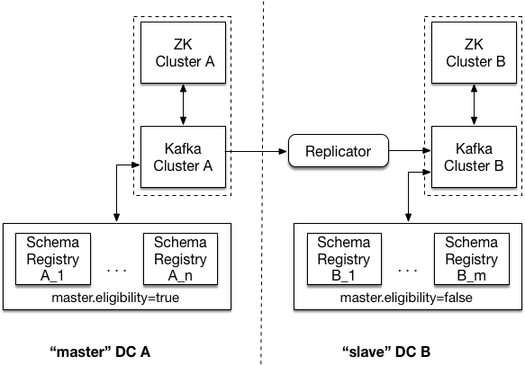

.. _schemaregistry_mirroring:

|sr| Multi-DC Setup
===================

Spanning multiple datacenters with your |sr| provides additional protection against data loss and improved latency. The recommended multi-datacenter deployment designates one datacenter as "master" and all others as "slaves". If the "master" datacenter fails and is unrecoverable, a "slave" datacenter will need to be manually designated the new "master" through the steps in the Run Book below.

Kafka Election
--------------

Recommended Deployment
^^^^^^^^^^^^^^^^^^^^^^

    Multi DC with Kafka based master election

In the image above, there are two data centers - DC A, and DC B. Each of the two data centers has
its own |zk| cluster, Kafka cluster, and |sr| cluster. The |sr|
clusters link to Kafka clusters in the respective DC.

Note that the |sr| instances in DC B have ``master.eligibility`` set to false, meaning
that none can ever be elected master.

To protect against complete loss of DC A, Kafka cluster A (the source) is replicated to Kafka cluster B (the target). This is achieved by running the :ref:`Replicator` <connect_replicator>` local to the target cluster.

Important Settings
^^^^^^^^^^^^^^^^^^

``kafkastore.bootstrap.servers``
kafkastore.bootstrap.servers should point to the local Kafka cluster

``schema.registry.group.id``
Use this setting to override the group.id for the Kafka group used when Kafka is used for master election. Without this configuration, group.id will be "schema-registry". If you want to run more than one |sr| cluster against a single Kafka cluster you should make this setting unique for each cluster.

``master.eligibility``
A |sr| server with ``master.eligibility`` set to false is guaranteed to remain a slave during any master election. |sr| instances in a "slave" data center should have this set to false, and |sr| instances local to the shared Kafka cluster should have this set to true.

Setup
^^^^^

Assuming you have |sr| running, here are the recommended steps to add |sr| instances in a new "slave" datacenter (call it DC B):

- In DC B, make sure Kafka has ``unclean.leader.election.enable`` set to false.

- In DC B, run Replicator with Kafka in the "master" datacenter (DC A) as the source and Kafka in DC B as the target.

- In the |sr| config files in DC B, set the ``kafkastore.bootstrap.servers`` to point to Kafka Cluster in DC B and set ``master.eligibility`` to false.

- Start your new |sr| instances with these configs.

Run Book
^^^^^^^^

Let's say you have |sr| running in multiple datacenters, and you have lost your "master" datacenter; what do you do? First, note that the remaining |sr| instances will continue to be able to serve any request which does not result in a write to Kafka. This includes GET requests on existing IDs and POST requests on schemas already in the registry.

- If possible, revive the "master" datacenter by starting Kafka and |sr| as before.

- If you must designate a new datacenter (call it DC B) as "master", update the |sr| config files so that ``master.eligibility`` is set to true. Then restart your |sr| instances with these new configs in a rolling fashion.

|zk| Election
------------------

Recommended Deployment
^^^^^^^^^^^^^^^^^^^^^^

.. figure:: multi-dc-setup.png
    :align: center

    Multi DC with Zookeeper based master election

In the image above, there are two data centers - DC A, and DC B. Each of the two data centers has
its own |zk| cluster, Kafka cluster, and |sr| cluster. Both |sr|
clusters link to Kafka and |zk| in DC A.

Note that the |sr| instances in DC B have ``master.eligibility`` set to false, meaning that none can ever be elected master.

To protect against complete loss of DC A, Kafka cluster A (the source) is replicated to Kafka cluster B (the target). This is achieved by running the :ref:`Replicator` <connect_replicator>` local to the target cluster.

Important Settings
^^^^^^^^^^^^^^^^^^

``kafkastore.connection.url``
kafkastore.connection.url should be identical across all |sr| nodes. By sharing this setting, all |sr| instances will point to the same |zk| cluster.

``schema.registry.zk.namespace``
Namespace under which |sr| related metadata is stored in |zk|. This setting should be identical across all nodes in the same |sr|.

``master.eligibility``
A |sr| server with ``master.eligibility`` set to false is guaranteed to remain a slave during any master election. |sr| instances in a "slave" data center should have this set to false, and |sr| instances local to the shared Kafka cluster should have this set to true.

Setup
^^^^^

Assuming you have |sr| running, here are the recommended steps to add |sr| instances in a new "slave" datacenter (call it DC B):

- In DC B, make sure Kafka has ``unclean.leader.election.enable`` set to false.

- In DC B, run Replicator with Kafka in the "master" datacenter (DC A) as the source and Kafka in DC B as the target.

- In the |sr| config files in DC B, set ``kafkastore.connection.url`` and ``schema.registry.zk.namespace`` to match the instances already running, and set ``master.eligibility`` to false.

- Start your new |sr| instances with these configs.

Run Book
^^^^^^^^

Let's say you have |sr| running in multiple datacenters, and you have lost your "master" datacenter; what do you do? First, note that the remaining |sr| instances will continue to be able to serve any request which does not result in a write to Kafka. This includes GET requests on existing IDs and POST requests on schemas already in the registry.

- If possible, revive the "master" datacenter by starting Kafka and |sr| as before.

- If you must designate a new datacenter (call it DC B) as "master", update the |sr| config files so that ``kafkastore.connection.url`` points to the local |zk|, and change ``master.eligibility`` to true. The restart your |sr| instances with these new configs in a rolling fashion.
