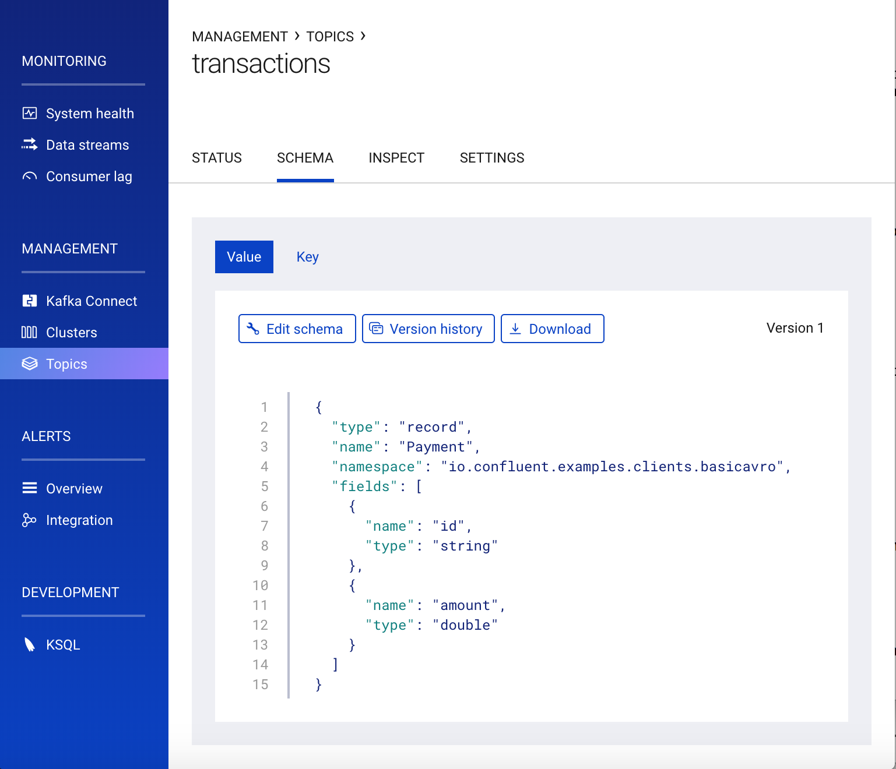
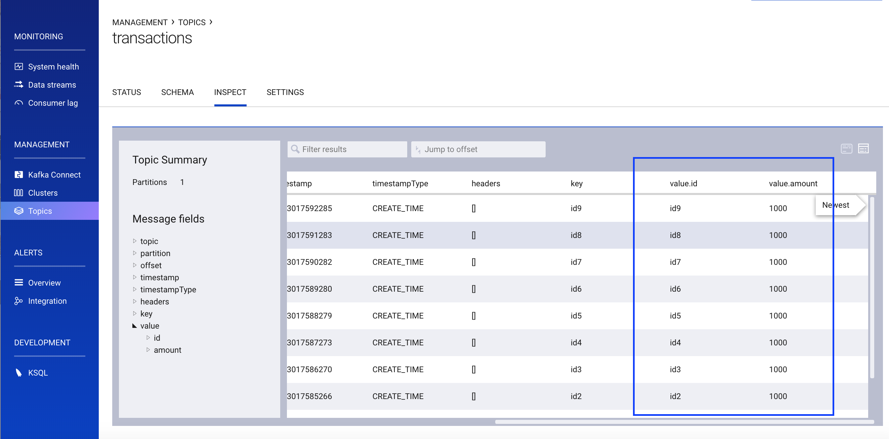

.. _schema_registry_tutorial:

Confluent Schema Registry Tutorial
==================================

Overview
~~~~~~~~

This tutorial provides a step-by-step workflow for using |sr-long|.
You will learn how to enable client applications to read and write Avro data, check compatibility as schemas evolve, and use |c3|, which has integrated capabilities with |sr-long|.

Benefits
^^^^^^^^

Kafka producers write data to Kafka topics and Kafka consumers read data from Kafka topics.
There is an implicit "contract" that producers write data with a schema that can be read by consumers, even as producers and consumers evolve their schemas.
|sr-long| helps ensure that this contract is met with compatibility checks.

It is useful to think about schemas as APIs.
Applications depend on APIs and expect any changes made to APIs are still compatible and applications can still run.
Similarly, streaming applications depend on schemas and expect any changes made to schemas are still compatible and they can still run.
Schema evolution requires compatibility checks to ensure that the producer-consumer contract is not broken. 
This is where |sr-long| helps: it provides centralized schema management and compatibility checks as schemas evolve.

Target Audience
^^^^^^^^^^^^^^^

The target audience is a developer writing Kafka streaming applications who wants to build a robust application leveraging Avro data and |sr-long|. The principles in this tutorial apply to any Kafka client that interacts with |sr|.

This tutorial is not meant to cover the operational aspects of running the |sr| service. For production deployments of |sr-long|, refer to :ref:`schema-registry-prod`.

Before You Begin
~~~~~~~~~~~~~~~~

Prerequisites
^^^^^^^^^^^^^

Before proceeding with this tutorial

#. Verify that you have installed the following on your local machine:

   * `Confluent Platform 5.2 or later <https://www.confluent.io/download/>`__
   * Java 1.8 to run |cp|
   * Maven to compile the client Java code
   * ``jq`` tool to nicely format the results from querying the |sr| REST endpoint

#. Use the :ref:`quickstart` to bring up |cp|. With a single-line command, you can have a basic Kafka cluster with |sr-long|, |c3|, and other services running on your local machine.

   .. sourcecode:: bash

      $ confluent start
   
      This CLI is intended for development only, not for production
      https://docs.confluent.io/current/cli/index.html
   
      Starting zookeeper
      zookeeper is [UP]
      Starting kafka
      kafka is [UP]
      Starting schema-registry
      schema-registry is [UP]
      Starting kafka-rest
      kafka-rest is [UP]
      Starting connect
      connect is [UP]
      Starting ksql-server
      ksql-server is [UP]
      Starting control-center
      control-center is [UP]

#. For the exercises in this tutorial, you will be producing to and consuming from a topic called `transactions`. Create this topic in |c3|.

    #.  Navigate to the |c3-short| web interface at `http://localhost:9021/ <http://localhost:9021/>`_.

        .. important:: It may take a minute or two for |c3-short| to come online.

        .. image:: images/c3-landing-page.png
            :width: 600px

    #.  Select **Management -> Topics** and click **Create topic**.
    
        .. image:: images/c3-create-topic.png
            :width: 600px
    
    #.  Create a topic named ``transactions`` and click **Create with defaults**.
    

#. Clone the |cp| `examples <https://github.com/confluentinc/examples>`_ repo from GitHub and work in the `clients/avro/` subdirectory, which provides the sample code you will compile and run in this tutorial.

   .. codewithvars:: bash

      $ git clone https://github.com/confluentinc/examples.git
      $ git checkout |release|-post
      $ cd examples/clients/avro

   

.. _schema_registry_tutorial_definition:

Terminology
^^^^^^^^^^^

First let us levelset on terminology: what is a `topic` versus a `schema` versus a `subject`.

A Kafka `topic` contains messages, and each message is a key-value pair.
Either the message key or the message value, or both, can be serialized as Avro.
A `schema` defines the structure of the Avro data format.
The Kafka topic name can be independent of the schema name.
|sr| defines a scope in which schemas can evolve, and that scope is the `subject`.
The name of the subject depends on the configured `subject name strategy <https://docs.confluent.io/current/schema-registry/docs/serializer-formatter.html#subject-name-strategy>`_, which by default is set to derive subject name from topic name.

As a practical example, let's say a retail business is streaming transactions in a Kafka topic called `transactions`.
A producer is writing data with a schema `Payment` to that Kafka topic `transactions`.
If the producer is serializing the message value as Avro, then |sr| has a subject called `transactions-value`.
If the producer is also serializing the message key as Avro, |sr| would have a subject called `transactions-key`, but for simplicity, in this tutorial consider only the message value.
That |sr| subject `transactions-value` has at least one schema called `Payment`.
The subject `transactions-value` defines the scope in which schemas for that subject can evolve and |sr| does compatibility checking within this scope.
In this scenario, if developers evolve the schema `Payment` and produce new messages to the topic `transactions`, |sr| checks that those newly evolved schemas are compatible with older schemas in the subject `transactions-value` and adds those new schemas to the subject.

.. _schema_registry_tutorial_definition:

Schema Definition
~~~~~~~~~~~~~~~~~

The first thing developers need to do is agree on a basic schema for data.
Client applications form a contract: producers will write data in a schema and consumers will be able to read that data.

Consider the :devx-examples:`original Payment schema|clients/avro/src/main/resources/avro/io/confluent/examples/clients/basicavro/Payment.avsc`:

.. sourcecode:: json

   $ cat src/main/resources/avro/io/confluent/examples/clients/basicavro/Payment.avsc
   {"namespace": "io.confluent.examples.clients.basicavro",
    "type": "record",
    "name": "Payment",
    "fields": [
        {"name": "id", "type": "string"},
        {"name": "amount", "type": "double"}
    ]
   }

Let's break down what this schema defines

* ``namespace``: a fully qualified name that avoids schema naming conflicts
* ``type``: `Avro data type <https://avro.apache.org/docs/1.8.1/spec.html#schemas>`_, one of ``record``, ``enum``, ``union``, ``array``, ``map``, ``fixed``
* ``name``: unique schema name in this namespace
* ``fields``: one or more simple or complex data types for a ``record``. The first field in this record is called `id`, and it is of type `string`. The second field in this record is called `amount`, and it is of type `double`.

Client Applications Writing Avro
~~~~~~~~~~~~~~~~~~~~~~~~~~~~~~~~

Maven
^^^^^

This tutorial uses Maven to configure the project and dependencies.
Java applications that have Kafka producers or consumers using Avro require ``pom.xml`` files to include, among other things:

* Confluent Maven repository
* Confluent Maven plugin repository
* Dependencies ``org.apache.avro.avro`` and ``io.confluent.kafka-avro-serializer`` to serialize data as Avro
* Plugin ``avro-maven-plugin`` to generate Java class files from the source schema

The ``pom.xml`` file may also include:

* Plugin ``kafka-schema-registry-maven-plugin`` to check compatibility of evolving schemas

For a full pom.xml example, refer to this :devx-examples:`pom.xml|clients/avro/pom.xml`.

Configuring Avro
^^^^^^^^^^^^^^^^

Apache Kafka applications using Avro data and |sr-long| need to specify at least two configuration parameters:

* Avro serializer or deserializer
* URL to the |sr-long|

There are two basic types of Avro records that your application can use: a specific code-generated class or a generic record.
The examples in this tutorial demonstrate how to use the specific `Payment` class.
Using a specific code-generated class requires you to define and compile a Java class for your schema, but it easier to work with in your code.
However, in other scenarios where you need to work dynamically with data of any type and do not have Java classes for your record types, use `GenericRecord <https://docs.confluent.io/current/streams/developer-guide/datatypes.html#avro>`_.

Java Producers
^^^^^^^^^^^^^^

Within the application, Java producers need to configure the Avro serializer for the Kafka value (or Kafka key) and URL to |sr-long|.
Then the producer can write records where the Kafka value is of `Payment` class.
When constructing the producer, configure the message value class to use the application's code-generated `Payment` class.
For example:

.. sourcecode:: java

   import io.confluent.kafka.serializers.KafkaAvroSerializer;
   import io.confluent.kafka.serializers.AbstractKafkaAvroSerDeConfig;

   ...
   props.put(ProducerConfig.VALUE_SERIALIZER_CLASS_CONFIG, KafkaAvroSerializer.class);
   props.put(AbstractKafkaAvroSerDeConfig.SCHEMA_REGISTRY_URL_CONFIG, schemaRegistryUrl);
   ...

   ...
   KafkaProducer<String, Payment> producer = new KafkaProducer<String, Payment>(props));
   final Payment payment = new Payment(orderId, 1000.00d);
   final ProducerRecord<String, Payment> record = new ProducerRecord<String, Payment>(TOPIC, payment.getId().toString(), payment);
   producer.send(record);
   ...

For a full Java producer example, refer to :devx-examples:`the producer example|clients/avro/src/main/java/io/confluent/examples/clients/basicavro/ProducerExample.java`.
Because the `pom.xml` includes ``avro-maven-plugin``, the `Payment` class is automatically generated during compile.
To run this producer, first compile the project and then run ``ProducerExample``.

.. sourcecode:: bash

   $ mvn clean compile package
   $ mvn exec:java -Dexec.mainClass=io.confluent.examples.clients.basicavro.ProducerExample

You should see:

.. sourcecode:: bash

   ...
   Successfully produced 10 messages to a topic called transactions
   ...

Java Consumers
^^^^^^^^^^^^^^

Within the application, Java consumers need to configure the Avro deserializer for the Kafka value (or Kafka key) and URL to |sr-long|.
Then the consumer can read records where the Kafka value is of `Payment` class.
By default, each record is deserialized into an Avro `GenericRecord`, but in this tutorial the record should be deserialized using the application's code-generated `Payment` class.
Therefore, configure the deserializer to use Avro `SpecificRecord`, i.e., ``SPECIFIC_AVRO_READER_CONFIG`` should be set to `true`.
For example:

.. sourcecode:: java

   import io.confluent.kafka.serializers.KafkaAvroDeserializer;
   import io.confluent.kafka.serializers.AbstractKafkaAvroSerDeConfig;

   ...
   props.put(ConsumerConfig.VALUE_DESERIALIZER_CLASS_CONFIG, KafkaAvroDeserializer.class);
   props.put(KafkaAvroDeserializerConfig.SPECIFIC_AVRO_READER_CONFIG, true); 
   props.put(AbstractKafkaAvroSerDeConfig.SCHEMA_REGISTRY_URL_CONFIG, schemaRegistryUrl);
   ...

   ...
   KafkaConsumer<String, Payment> consumer = new KafkaConsumer<>(props));
   consumer.subscribe(Collections.singletonList(TOPIC));
   while (true) {
     ConsumerRecords<String, Payment> records = consumer.poll(100);
     for (ConsumerRecord<String, Payment> record : records) {
       String key = record.key();
       Payment value = record.value();
     }
   }
   ...

For a full Java consumer example, refer to :devx-examples:`the consumer example|clients/avro/src/main/java/io/confluent/examples/clients/basicavro/ConsumerExample.java`.
Because the `pom.xml` includes ``avro-maven-plugin``, the `Payment` class is automatically generated during compile.
To run this consumer, first compile the project and then run ``ConsumerExample`` (assuming you already ran the ``ProducerExample`` above).

.. sourcecode:: bash

   $ mvn clean compile package
   $ mvn exec:java -Dexec.mainClass=io.confluent.examples.clients.basicavro.ConsumerExample

You should see:

.. sourcecode:: bash

   ...
   offset = 0, key = id0, value = {"id": "id0", "amount": 1000.0}
   offset = 1, key = id1, value = {"id": "id1", "amount": 1000.0}
   offset = 2, key = id2, value = {"id": "id2", "amount": 1000.0}
   offset = 3, key = id3, value = {"id": "id3", "amount": 1000.0}
   offset = 4, key = id4, value = {"id": "id4", "amount": 1000.0}
   offset = 5, key = id5, value = {"id": "id5", "amount": 1000.0}
   offset = 6, key = id6, value = {"id": "id6", "amount": 1000.0}
   offset = 7, key = id7, value = {"id": "id7", "amount": 1000.0}
   offset = 8, key = id8, value = {"id": "id8", "amount": 1000.0}
   offset = 9, key = id9, value = {"id": "id9", "amount": 1000.0}
   ...

Hit ``Ctrl-C`` to stop.

Other Kafka Clients
^^^^^^^^^^^^^^^^^^^

The objective of this tutorial is to learn about Avro and |sr| centralized schema management and compatibility checks.
To keep examples simple, this tutorial focuses on Java producers and consumers, but other Kafka clients work in similar ways.
For examples of other Kafka clients interoperating with Avro and |sr|:

* `KSQL <https://docs.confluent.io/current/ksql/docs/installation/server-config/avro-schema.html#configuring-avro-and-sr-for-ksql>`_
* `Kafka Streams <https://docs.confluent.io/current/streams/developer-guide/datatypes.html#avro>`_
* `Kafka Connect <https://docs.confluent.io/current/schema-registry/docs/connect.html#using-kafka-connect-with-sr>`_
* `Confluent REST Proxy <https://docs.confluent.io/current/kafka-rest/docs/api.html#post--topics-(string-topic_name)-partitions-(int-partition_id)>`_
* `Non-Java clients based on librdkafka <https://docs.confluent.io/current/clients/index.html>`_ , including Confluent Python, Confluent Go, Confluent DotNet

Centralized Schema Management
~~~~~~~~~~~~~~~~~~~~~~~~~~~~~

Schemas in Schema Registry
^^^^^^^^^^^^^^^^^^^^^^^^^^

At this point, you have producers serializing Avro data and consumers deserializing Avro data.
The producers are registering schemas and consumers are retrieving schemas.
You can view subjects and associated schemas via the REST endpoint in |sr|.

View all the subjects registered in |sr| (assuming |sr| is running on the local machine listening on port 8081):

.. sourcecode:: bash

   $ curl --silent -X GET http://localhost:8081/subjects/ | jq .  
   [
     "transactions-value"
   ]

In this example, the Kafka topic `transactions` has messages whose value, i.e., payload, is Avro.

View the associated subject `transactions-value` in |sr|:

.. sourcecode:: bash

   $ curl --silent -X GET http://localhost:8081/subjects/transactions-value/versions/latest | jq .
   {
     "subject": "transactions-value",
     "version": 1,
     "id": 1,
     "schema": "{\"type\":\"record\",\"name\":\"Payment\",\"namespace\":\"io.confluent.examples.clients.basicavro\",\"fields\":[{\"name\":\"id\",\"type\":\"string\"},{\"name\":\"amount\",\"type\":\"double\"}]}"
   }

Let's break down what this version of the schema defines

* `subject`: the scope in which schemas for the messages in the topic `transactions` can evolve
* `version`: the schema version for this subject, which starts at 1 for each subject
* `id`: the globally unique schema version id, unique across all schemas in all subjects
* `schema`: the structure that defines the schema format

The schema is identical to the :ref:`schema file defined for Java client applications<schema_registry_tutorial_definition>`.
Notice in the output above, the schema is escaped JSON, i.e., the double quotes are preceded with backslashes.

Based on the schema id, you can also retrieve the associated schema by querying |sr| REST endpoint:

.. sourcecode:: bash

   $ curl --silent -X GET http://localhost:8081/schemas/ids/1 | jq .
   {
     "schema": "{\"type\":\"record\",\"name\":\"Payment\",\"namespace\":\"io.confluent.examples.clients.basicavro\",\"fields\":[{\"name\":\"id\",\"type\":\"string\"},{\"name\":\"amount\",\"type\":\"double\"}]}"
   }

Schema IDs in Messages
^^^^^^^^^^^^^^^^^^^^^^

Integration with |sr-long| means that Kafka messages do not need to be written with the entire Avro schema.
Instead, Kafka messages are written with the schema id.
The producers writing the messages and the consumers reading the messages must be using the same |sr| to get the same mapping between a schema and schema id.

In this example, a producer sends the new schema for `Payments` to |sr|.
|sr| registers this schema `Payments` to the subject `transactions-value`, and returns the schema id of `1` to the producer.
The producer caches this mapping between the schema and schema id for subsequent message writes, so it only contacts |sr| on the first schema write.
When a consumer reads this data, it sees the Avro schema id of `1` and sends a schema request to |sr|.
|sr| retrieves the schema associated to schema id `1`, and returns the schema to the consumer.
The consumer caches this mapping between the schema and schema id for subsequent message reads, so it only contacts |sr| the on first schema id read.

Auto Schema Registration
^^^^^^^^^^^^^^^^^^^^^^^^

.. include:: includes/auto-schema-registration.rst

To manually register the schema outside of the application, send the schema to |sr| and associate it with a subject, in this case `transactions-value`.  It returns a schema id of `1`.

.. sourcecode:: bash

   $ curl -X POST -H "Content-Type: application/vnd.schemaregistry.v1+json" --data '{"schema": "{\"type\":\"record\",\"name\":\"Payment\",\"namespace\":\"io.confluent.examples.clients.basicavro\",\"fields\":[{\"name\":\"id\",\"type\":\"string\"},{\"name\":\"amount\",\"type\":\"double\"}]}"}' http://localhost:8081/subjects/transactions-value/versions
   {"id":1}

Schema Evolution and Compatibility
~~~~~~~~~~~~~~~~~~~~~~~~~~~~~~~~~~

Changing Schemas
^^^^^^^^^^^^^^^^

So far in this tutorial, you have seen the benefit of |sr-long| as being centralized schema management that enables client applications to register and retrieve globally unique schema ids.
The main value of |sr|, however, is in enabling schema evolution.
Similar to how APIs evolve and need to be compatible for all applications that rely on old and new versions of the API, schemas also evolve and likewise need to be compatible for all applications that rely on old and new versions of a schema.
This schema evolution is a natural behavior of how applications and data develop over time.

|sr-long| allows for schema evolution and provides compatibility checks to ensure that the contract between producers and consumers is not broken.
This allows producers and consumers to update independently and evolve their schemas independently, with assurances that they can read new and legacy data.
This is especially important in Kafka because producers and consumers are decoupled applications that are sometimes developed by different teams.

.. include:: includes/transitive.rst

These are the compatibility types:

.. include:: includes/compatibility_list.rst

You can change this globally or per subject, but for the remainder of this tutorial, leave the default compatibility type to `backward`.
Refer to :ref:`schema_evolution_and_compatibility` for a more in-depth explanation on the compatibility types.

Failing Compatibility Checks
^^^^^^^^^^^^^^^^^^^^^^^^^^^^

|sr| checks compatibility as schemas evolve to uphold the producer-consumer contract.
Without |sr| checking compatibility, your applications could potentially break on schema changes.

In the Payment schema example, let's say the business now tracks additional information for each payment, for example, a field ``region`` that represents the place of sale.
Consider the :devx-examples:`Payment2a schema|clients/avro/src/main/resources/avro/io/confluent/examples/clients/basicavro/Payment2a.avsc` which includes this extra field ``region``:

.. sourcecode:: json

   $ cat src/main/resources/avro/io/confluent/examples/clients/basicavro/Payment2a.avsc
   {"namespace": "io.confluent.examples.clients.basicavro",
    "type": "record",
    "name": "Payment",
    "fields": [
        {"name": "id", "type": "string"},
        {"name": "amount", "type": "double"},
        {"name": "region", "type": "string"}
    ]
   }

Before proceeding, think about whether this schema is backward compatible.
Specifically, ask yourself whether a consumer can use this new schema to read data written by producers using the older schema without the `region` field?
The answer is no.
Consumers will fail reading data with the older schema because the older data does not have the `region` field, therefore this schema is not backward compatible.

Confluent provides a `Schema Registry Maven Plugin <https://docs.confluent.io/current/schema-registry/docs/maven-plugin.html#sr-maven-plugin>`_, which you can use to check compatibility in development or integrate into your CI/CD pipeline.
Our sample :devx-examples:`pom.xml|clients/avro/pom.xml#L84-L99` includes this plugin to enable compatibility checks.

.. sourcecode:: xml

      <plugin>
          <groupId>io.confluent</groupId>
          <artifactId>kafka-schema-registry-maven-plugin</artifactId>
          <version>5.0.0</version>
          <configuration>
              <schemaRegistryUrls>
                  <param>http://localhost:8081</param>
              </schemaRegistryUrls>
              <subjects>
                  <transactions-value>src/main/resources/avro/io/confluent/examples/clients/basicavro/Payment2a.avsc</transactions-value>
              </subjects>
          </configuration>
          <goals>
              <goal>test-compatibility</goal>
          </goals>
      </plugin>

It is currently configured to check compatibility of the new `Payment2a` schema for the `transactions-value` subject in |sr|.
Run the compatibility check and verify that it fails:

.. sourcecode:: bash

   $ mvn io.confluent:kafka-schema-registry-maven-plugin:5.0.0:test-compatibility
   ...
   [ERROR] Schema examples/clients/avro/src/main/resources/avro/io/confluent/examples/clients/basicavro/Payment2a.avsc is not compatible with subject(transactions-value)
   ...

You could have also just tried to register the new schema `Payment2a` manually to |sr|, which is a useful way for non-Java clients to check compatibility.
As expected, |sr| rejects it with an error message that it is incompatible.

.. sourcecode:: bash

   $ curl -X POST -H "Content-Type: application/vnd.schemaregistry.v1+json" --data '{"schema": "{\"type\":\"record\",\"name\":\"Payment\",\"namespace\":\"io.confluent.examples.clients.basicavro\",\"fields\":[{\"name\":\"id\",\"type\":\"string\"},{\"name\":\"amount\",\"type\":\"double\"},{\"name\":\"region\",\"type\":\"string\"}]}"}' http://localhost:8081/subjects/transactions-value/versions
   {"error_code":409,"message":"Schema being registered is incompatible with an earlier schema"}

Passing Compatibility Checks
^^^^^^^^^^^^^^^^^^^^^^^^^^^^

To maintain backward compatibility, a new schema must assume default values for the new field if it is not provided.
Consider an updated :devx-examples:`Payment2b schema|clients/avro/src/main/resources/avro/io/confluent/examples/clients/basicavro/Payment2b.avsc` that has a default value for ``region``:

.. sourcecode:: json

   $ cat src/main/resources/avro/io/confluent/examples/clients/basicavro/Payment2b.avsc
   {"namespace": "io.confluent.examples.clients.basicavro",
    "type": "record",
    "name": "Payment",
    "fields": [
        {"name": "id", "type": "string"},
        {"name": "amount", "type": "double"},
        {"name": "region", "type": "string", "default": ""}
    ]
   }

Update the :devx-examples:`pom.xml|clients/avro/pom.xml` to refer to `Payment2b.avsc` instead of `Payment2a.avsc`.
Re-run the compatibility check and verify that it passes:

.. sourcecode:: bash

   $ mvn io.confluent:kafka-schema-registry-maven-plugin:5.0.0:test-compatibility
   ...
   [INFO] Schema examples/clients/avro/src/main/resources/avro/io/confluent/examples/clients/basicavro/Payment2b.avsc is compatible with subject(transactions-value)
   ...

You can try registering the new schema `Payment2b` directly, and it succeeds.

.. sourcecode:: bash

   $ curl -X POST -H "Content-Type: application/vnd.schemaregistry.v1+json" --data '{"schema": "{\"type\":\"record\",\"name\":\"Payment\",\"namespace\":\"io.confluent.examples.clients.basicavro\",\"fields\":[{\"name\":\"id\",\"type\":\"string\"},{\"name\":\"amount\",\"type\":\"double\"},{\"name\":\"region\",\"type\":\"string\",\"default\":\"\"}]}"}' http://localhost:8081/subjects/transactions-value/versions
   {"id":2}

View the latest subject for `transactions-value` in |sr|:

.. sourcecode:: bash

   $ curl --silent -X GET http://localhost:8081/subjects/transactions-value/versions/latest | jq .
   {
     "subject": "transactions-value",
     "version": 2,
     "id": 2,
     "schema": "{\"type\":\"record\",\"name\":\"Payment\",\"namespace\":\"io.confluent.examples.clients.basicavro\",\"fields\":[{\"name\":\"id\",\"type\":\"string\"},{\"name\":\"amount\",\"type\":\"double\"},{\"name\":\"region\",\"type\":\"string\",\"default\":\"\"}]}"
   }

Notice the changes:

* `version`: changed from `1` to `2`
* `id`: changed from `1` to `2`
* `schema`: updated with the new field `region` that has a default value

Schema Management with Confluent Control Center
^^^^^^^^^^^^^^^^^^^^^^^^^^^^^^^^^^^^^^^^^^^^^^^

|c3| can retrieve a topic's schema from the |sr| and display it:

As new Avro-serialized data arrives into the topic `transactions`, |c3| dynamically deserializes the data and shows the messages live:

Next Steps
~~~~~~~~~~

* Adapt your applications to use Avro data
* Change compatibility modes to suit your application needs
* Test new schemas so that they pass compatibility checks
* For a more in-depth understanding of the benefits of Avro, read `Why Avro For Kafka Data <https://www.confluent.io/blog/avro-kafka-data/>`_
* For a more in-depth understanding of the benefits of |sr-long|, read `Yes, Virginia, You Really Do Need a Schema Registry <https://www.confluent.io/blog/schema-registry-kafka-stream-processing-yes-virginia-you-really-need-one/>`_
